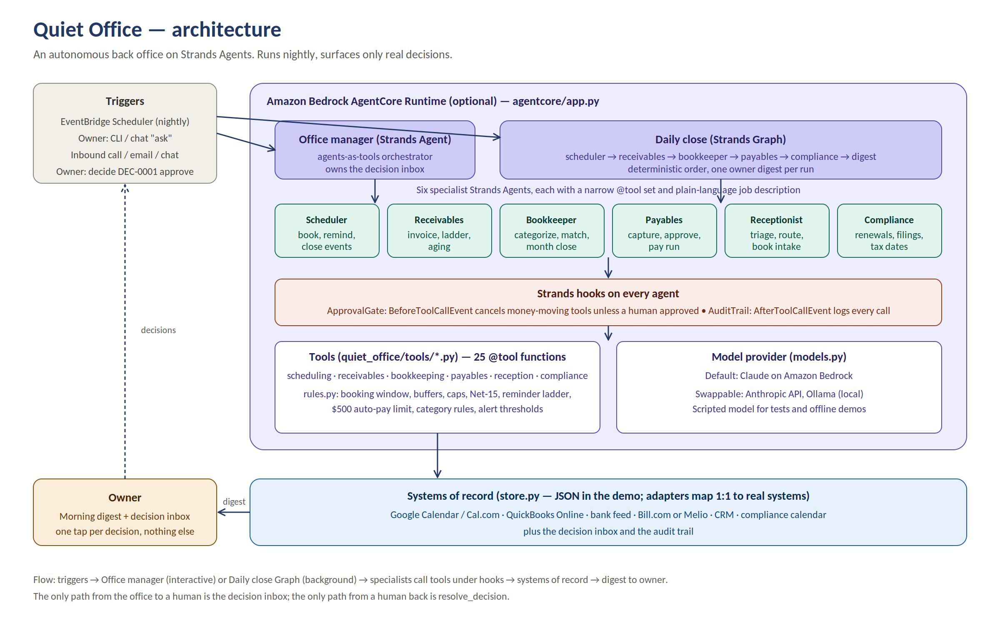

# Quiet Office

**An autonomous back office for small professional-services firms, built on [Strands Agents](https://strandsagents.com).**
It schedules, invoices, books, pays, answers, and watches compliance dates in the background — and the only time it talks to the owner is when there is a real decision to make.

Built for the [Agents for Humans Hackathon](https://agentsforhumans.devpost.com/) (Professional Agents track).



## The problem

A two-to-ten person consulting practice, design studio, or nonprofit loses 8–12 hours a week to the same loop: close out the calendar, type invoices, chase late payers, categorize the bank feed, approve and pay bills, answer "is this a client or spam?", and remember that the insurance renews Friday. None of it is hard. All of it is judgment-shaped busywork that interrupts the actual work.

## What Quiet Office does

Every night a **Strands Graph** runs six specialist agents in dependency order:

| Specialist | What it does on its own | What it hands to a human |
|---|---|---|
| Scheduler | Sends reminders, closes ended events, enforces buffers/caps/notice rules on new bookings | Repeat no-shows: pause this guest? |
| Receivables clerk | Invoices completed events, no-shows and retainers; runs a 4-step reminder ladder; reports AR aging | Day-45 invoices: payment plan, pause service, or write off? |
| Bookkeeper | Categorizes the bank feed by rule; matches deposits to invoices; runs the month-close checklist | Transactions no rule can place; deposits unapplied for 7+ days |
| Payables clerk | Auto-approves known vendors under $500; runs the weekly payment run | First-time vendors and larger bills: approve or reject |
| Receptionist | Triages calls/emails/chats against the CRM; routes clients, forwards vendors, offers leads an intake call | Unclear intent: how should we respond? |
| Compliance clerk | Watches renewals, filings and tax dates 30 days out | Anything due within 7 days: confirm it's handled |

The run ends with a **Digest writer** agent that produces one morning message: what happened, and a numbered list of decisions with one-tap options. An interactive **Office manager** agent (agents-as-tools) handles ad-hoc requests and applies the owner's decisions.

### What makes it safe to leave running

Two Strands **hooks** are attached to every agent:

- `ApprovalGate` intercepts `BeforeToolCallEvent` for money-moving tools. If a bill has not been approved by a human, the call is cancelled **outside the model** and a decision is raised. The agent cannot reason its way past it.
- `AuditTrail` logs every tool call on `AfterToolCallEvent`, so the owner can see exactly what the office did overnight.

Every policy number (booking window, Net-15 terms, reminder days, $500 auto-pay limit, category rules, alert thresholds) lives in one file, `quiet_office/rules.py`, so a client can be onboarded by changing configuration, not prompts.

## Quick start

```bash
git clone https://github.com/jgios21-afk/Quiet-Office && cd Quiet-Office
python -m venv .venv && source .venv/bin/activate
pip install -e ".[dev]"

quiet-office seed          # demo practice: 5 contacts, a month of activity queued up
quiet-office daily         # run the nightly close (needs a model, see below)
quiet-office inbox         # what needs the owner
quiet-office decide DEC-0029 approve
quiet-office ask "book Ava a working session Thursday at 2pm"
quiet-office advance 7 && quiet-office daily   # a week later
quiet-office audit
```

### Model providers

| `QUIET_OFFICE_PROVIDER` | What it uses | Needs |
|---|---|---|
| `bedrock` (default) | Claude on Amazon Bedrock | AWS credentials with Bedrock access |
| `anthropic` | Anthropic API | `ANTHROPIC_API_KEY`, `pip install -e ".[anthropic]"` |
| `ollama` | Local model | Ollama running |
| `scripted` | A scripted test double that calls each tool once — no reasoning | nothing (used for tests and offline demos) |

### Deploy to Amazon Bedrock AgentCore

```bash
pip install -e ".[agentcore]" bedrock-agentcore-starter-toolkit
agentcore configure -e agentcore/app.py
agentcore launch
agentcore invoke '{"action": "daily"}'
```

Schedule `{"action": "daily"}` with EventBridge Scheduler and the office is fully unattended.

## Tests

```bash
pytest -q
```

Eight tests cover booking rules, event-to-invoice flow, the reminder ladder, ask-don't-guess bookkeeping, the payables approval path, the hook blocking an unapproved payment from inside the agent loop, the full Graph run, and Office-manager delegation. They run in under a second with the scripted model.

## Project layout

```
quiet_office/
  agents.py        specialists, Office manager (agents-as-tools), daily-close Graph
  guardrails.py    ApprovalGate + AuditTrail hooks
  rules.py         every policy number in one place
  tools/           25 @tool functions across 7 modules
  store.py         JSON systems-of-record (adapters map 1:1 to Calendar, QuickBooks, etc.)
  daily.py         the background job
  cli.py           command line
  seed.py          demo data
agentcore/app.py   AgentCore Runtime entrypoint
tests/             pytest suite + scripted model
docs/              architecture diagram, implementation standard (Word)
```

## Roadmap

Real adapters (Google Calendar, Cal.com webhooks, QuickBooks Online, Plaid, Bill.com), a voice front door on Amazon Connect, AgentCore Memory for per-client preferences, and a one-page owner dashboard.

## License

Apache-2.0. See [LICENSE](LICENSE).
